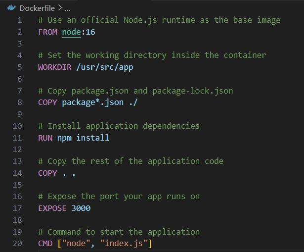
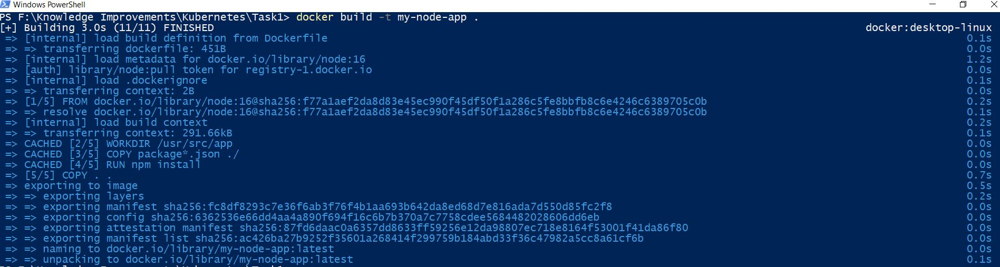
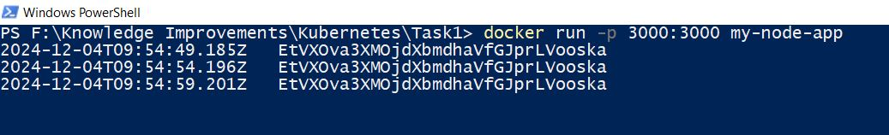
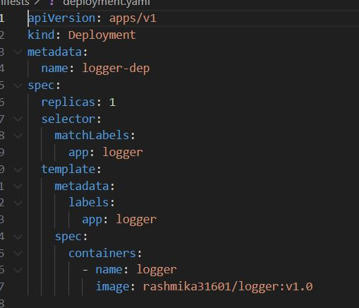
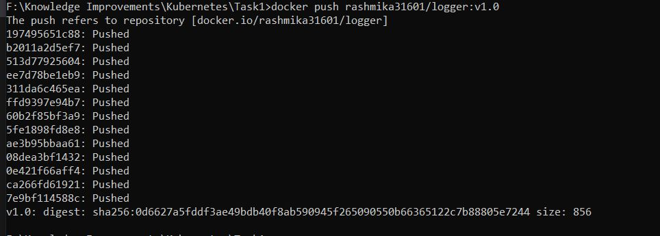
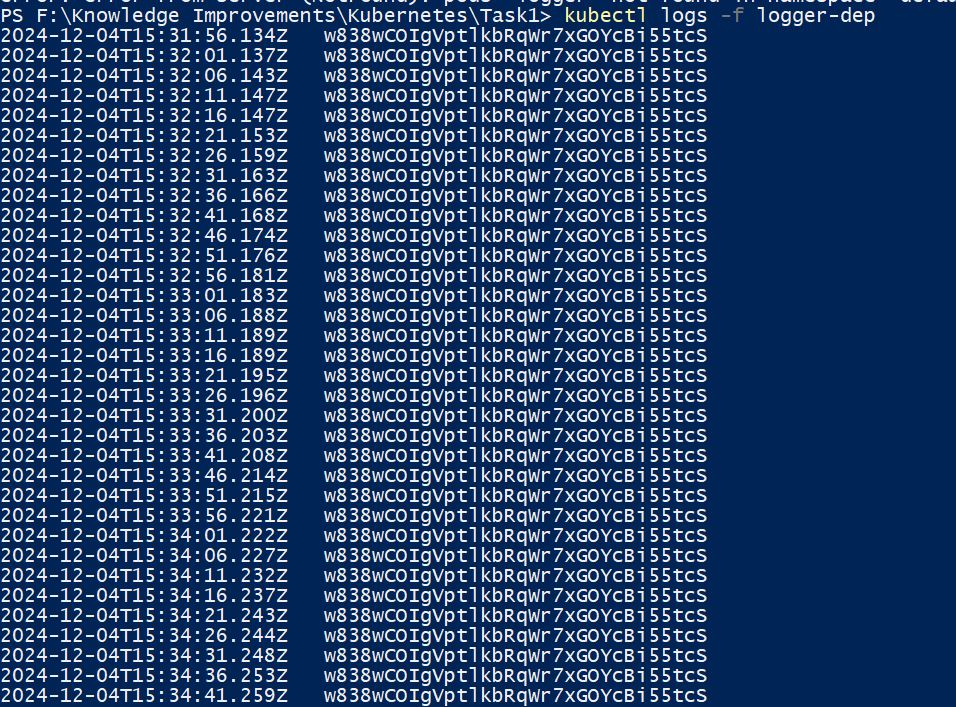

## Start the Docker and Kubernetes

1. k3d cluster create -a 2 : Create a cluster

2. k3d cluster stop : Stop the cluster

3. k3d cluster start : Start the cluster

4. k3d cluster delete : Delete the cluster

5. kubectl cluster-info : Cluster info

## Deployment with Docker

1. Used random-string-generator npm module to generate the random string

2. Update the given sample code to log the output in 5s

3. Use Docker file to create a docker image

4. Run the command "docker build -t my-node-app ." to generate the docker image

5. Run the command "docker run -p 3000:3000 my-node-app" to run the docker image. The result as follows,

7. To see the docker images use "docker images"

8. Need to tag username to docker image before push it "docker tag my-node-app rashmika31601/logger:v1.0"

9. Update the manifest folder deployment yaml file, The image and app name must corrected,

10. Build the docker file, "docker build -t rashmika31601/logger:v1.0 ." rashmika31601 is the docker username.

11. Login to docker "docker login".

12. Push the docker image to docker, "docker push rashmika31601/logger:v1.0"

## Kubectl

1. "kubectl run logger-dep --image=rashmika31601/logger --port=80" or use "kubectl create deployment --image=rashmika31601/logger" to create & deploy application

2. This will create a pod named logger and run the pod.

3. kubectl get pods : will show the pods that are created. (Objects)

4. kubectl get deployments : will show the deployments.

5. kubectl logs -f logger-dep : will show the output.

6. kubectl delete pods logger-dep-bfb4849bb-gnwzf : using this we can delete the pods.
