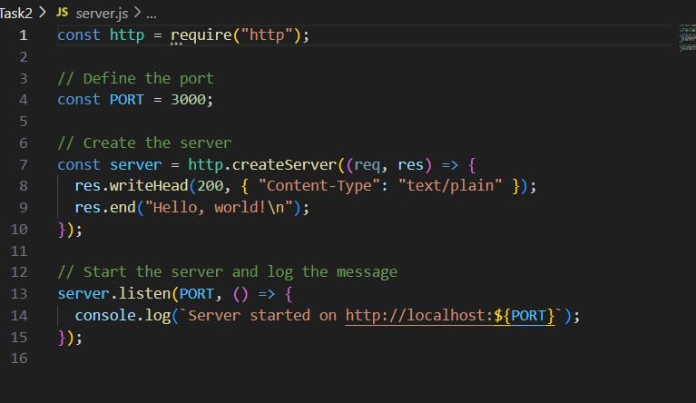
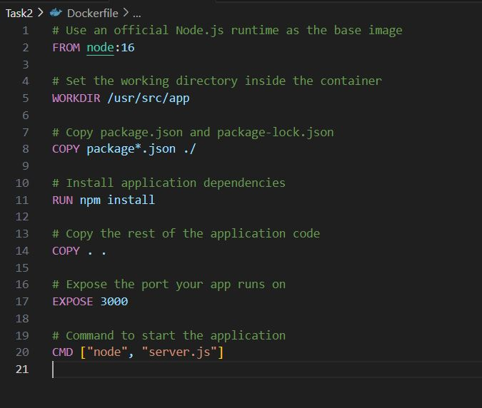
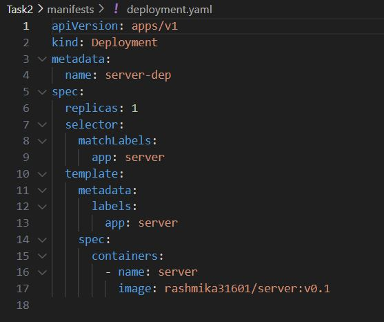
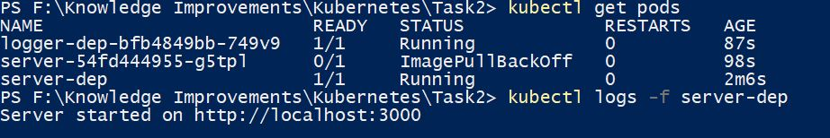

## Generate the server function using nodejs

## Deploy the server function to Kube

1. Update the Docker file.

2. Run the command "docker build -t server ." to generate the docker image

3. Tag the docker name and version "docker tag server rashmika31601/server:v0.1"

4. Update the manifest folder deployment yaml file, The image name and app name must corrected,

5. Build the docker file using,
   "docker build -t rashmika31601/server:v0.1 ."

6. Login to docker "docker login".

7. Push the docker image to docker,
   "docker push rashmika31601/server:v0.1"

8. Create Kube,
   "kubectl run server-dep --image=rashmika31601/server:v0.1 --port=80"

9. Check the pods, kubectl get pods

10. Use "kubectl logs -f server-dep" to see the response

